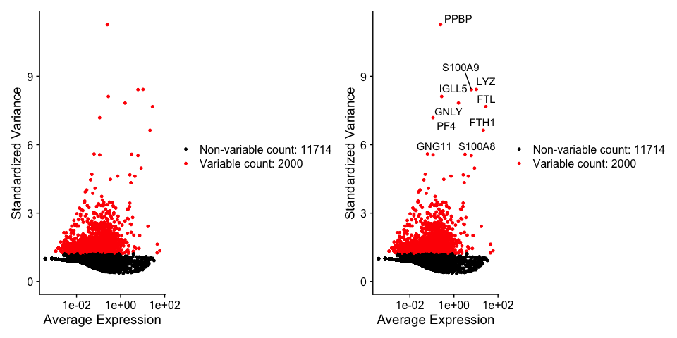
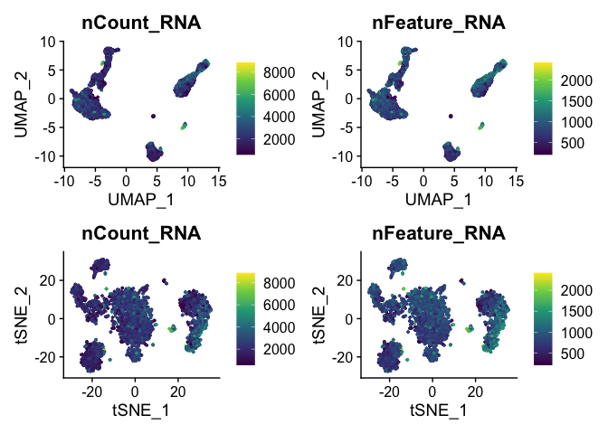

Seurat Tutorial
================

``` r
library(dplyr)
```

    ## 
    ## Attaching package: 'dplyr'

    ## The following objects are masked from 'package:stats':
    ## 
    ##     filter, lag

    ## The following objects are masked from 'package:base':
    ## 
    ##     intersect, setdiff, setequal, union

``` r
library(Seurat)
```

    ## Attaching SeuratObject

``` r
library(patchwork)
library(ggplot2)
library(ggsci)
library(readxl)
library(tidyr)
```

``` r
setwd("~/Documents/Projects/DevBioWorkshop/DevBio-scRNA-seq-Workshop/workspace/seurat")
# Load the PBMC dataset
pbmc.data <- Read10X(data.dir = "data/pbmc3k/filtered_gene_bc_matrices/hg19/")
# Initialize the Seurat object with the raw (non-normalized data).
pbmc <- CreateSeuratObject(counts = pbmc.data, project = "pbmc3k", min.cells = 3, min.features = 200)
```

    ## Warning: Feature names cannot have underscores ('_'), replacing with dashes
    ## ('-')

``` r
pbmc
```

    ## An object of class Seurat 
    ## 13714 features across 2700 samples within 1 assay 
    ## Active assay: RNA (13714 features, 0 variable features)

``` r
head(pbmc@meta.data)
```

    ##                  orig.ident nCount_RNA nFeature_RNA
    ## AAACATACAACCAC-1     pbmc3k       2419          779
    ## AAACATTGAGCTAC-1     pbmc3k       4903         1352
    ## AAACATTGATCAGC-1     pbmc3k       3147         1129
    ## AAACCGTGCTTCCG-1     pbmc3k       2639          960
    ## AAACCGTGTATGCG-1     pbmc3k        980          521
    ## AAACGCACTGGTAC-1     pbmc3k       2163          781

``` r
# The [[ operator can add columns to object metadata. This is a great place to stash QC stats
pbmc[["percent.mt"]] <- PercentageFeatureSet(pbmc, pattern = "^MT-")
```

``` r
pbmc <- subset(pbmc, subset = nFeature_RNA > 200 & nFeature_RNA < 2500 & percent.mt < 5)
```

``` r
pbmc.normtest <- NormalizeData(pbmc)
```

``` r
pbmc.normtest <- FindVariableFeatures(pbmc.normtest, selection.method = "vst", nfeatures = 2000)

# Identify the 10 most highly variable genes
top10 <- head(VariableFeatures(pbmc.normtest), 10)

# plot variable features with and without labels
plot1 <- VariableFeaturePlot(pbmc.normtest)
plot2 <- LabelPoints(plot = plot1, points = top10, repel = TRUE)
```

    ## When using repel, set xnudge and ynudge to 0 for optimal results

``` r
plot1 + plot2
```

    ## Warning: Transformation introduced infinite values in continuous x-axis

    ## Warning: Removed 1 rows containing missing values (geom_point).

    ## Warning: Transformation introduced infinite values in continuous x-axis

    ## Warning: Removed 1 rows containing missing values (geom_point).

<!-- -->

``` r
pbmc <- SCTransform(pbmc, vars.to.regress = "percent.mt", verbose = FALSE)
```

``` r
#if (!requireNamespace("BiocManager", quietly = TRUE)) install.packages("BiocManager")

#BiocManager::install("glmGamPoi")
pbmc <- SCTransform(pbmc, method = "glmGamPoi", vars.to.regress = "percent.mt", verbose = FALSE)
```

``` r
pbmc <- RunPCA(pbmc, features = VariableFeatures(object = pbmc))
```

    ## PC_ 1 
    ## Positive:  MALAT1, CCL5, NKG7, RPS27A, LTB, RPS3A, RPS6, IL32, RPL3, RPS3 
    ##     RPL13A, RPL9, RPSA, RPS12, RPS18, CD3D, RPL13, PTPRCAP, GZMA, CTSW 
    ##     CST7, RPL34, CD3E, CD7, GNLY, IL7R, RPS13, B2M, CXCR4, LDHB 
    ## Negative:  FTL, LYZ, FTH1, CST3, S100A9, S100A8, TYROBP, AIF1, FCN1, LST1 
    ##     LGALS1, FCER1G, LGALS2, S100A4, SAT1, S100A6, TYMP, COTL1, CTSS, IFITM3 
    ##     CFD, HLA-DRA, PSAP, S100A11, GPX1, OAZ1, SERPINA1, GSTP1, CD68, CD14 
    ## PC_ 2 
    ## Positive:  NKG7, CCL5, GZMB, GNLY, GZMA, CST7, PRF1, FGFBP2, CTSW, GZMH 
    ##     CCL4, SPON2, FCGR3A, B2M, CLIC3, CD247, GZMM, HOPX, KLRD1, HLA-C 
    ##     XCL2, ACTB, AKR1C3, IGFBP7, TTC38, S100A4, HLA-A, APMAP, S1PR5, FCER1G 
    ## Negative:  CD74, HLA-DRA, CD79A, HLA-DQA1, HLA-DPB1, HLA-DQB1, CD79B, TCL1A, MS4A1, HLA-DRB1 
    ##     HLA-DPA1, LINC00926, VPREB3, LTB, HLA-DRB5, HLA-DQA2, CD37, RPL13, RPL13A, FCER2 
    ##     HLA-DMA, RPS18, BANK1, RPS5, RPS2, HLA-DMB, RPL11, RPS6, TSPAN13, RPS12 
    ## PC_ 3 
    ## Positive:  CD74, HLA-DRA, CD79A, HLA-DPB1, NKG7, HLA-DQA1, CD79B, HLA-DRB1, HLA-DQB1, HLA-DPA1 
    ##     TCL1A, GZMB, MS4A1, GNLY, FGFBP2, PRF1, HLA-DRB5, CST7, GZMA, LINC00926 
    ##     HLA-DQA2, VPREB3, GZMH, CCL5, HLA-DMA, FCER2, CCL4, FCGR3A, CTSW, CD37 
    ## Negative:  S100A8, S100A9, JUNB, RPS12, IL7R, LDHB, CD3D, RPS6, RPS3, RPL13 
    ##     CD3E, NOSIP, TPT1, RPL34, RPL3, LYZ, RPS27A, RPS18, IL32, VIM 
    ##     FOS, RPL11, AQP3, RGCC, FTL, RPS3A, MAL, RPS2, CCR7, SOCS3 
    ## PC_ 4 
    ## Positive:  S100A8, S100A9, LYZ, LGALS2, CD14, GPX1, MS4A6A, GSTP1, FCN1, CCL3 
    ##     NKG7, S100A12, FOLR3, CEBPD, GRN, CSF3R, GNLY, RBP7, BLVRB, GAPDH 
    ##     ID1, IL8, VCAN, NCF1, ALDH2, GZMB, ASGR1, AP1S2, CST7, PLBD1 
    ## Negative:  FCGR3A, LST1, FCER1G, AIF1, MS4A7, IFITM3, FTH1, RHOC, IFITM2, RP11-290F20.3 
    ##     COTL1, TIMP1, SAT1, CDKN1C, CKB, SERPINA1, CEBPB, HMOX1, LILRA3, LRRC25 
    ##     ACTB, PILRA, STXBP2, SPI1, TMSB4X, ABI3, FAM110A, BID, WARS, LYN 
    ## PC_ 5 
    ## Positive:  FCGR3A, LST1, AIF1, IFITM3, FCER1G, GNLY, IFITM2, FTL, MALAT1, GZMB 
    ##     FGFBP2, TYROBP, PRF1, NKG7, FTH1, S100A4, MS4A7, RPS6, RP11-290F20.3, SERPINA1 
    ##     SPON2, S100A11, CTSS, JUNB, RPS3A, APOBEC3A, HLA-DPA1, RPL11, RPS12, RPL19 
    ## Negative:  GPX1, PPBP, CCL5, PF4, SDPR, NRGN, SPARC, GNG11, HIST1H2AC, RGS18 
    ##     CD9, CLU, GP9, TPM4, TUBB1, ITGA2B, AP001189.4, RUFY1, TAGLN2, CA2 
    ##     PTCRA, MPP1, TMEM40, TREML1, PGRMC1, TUBA4A, F13A1, ACRBP, MMD, GRAP2

``` r
pbmc <- RunUMAP(pbmc, dims = 1:30)
```

    ## Warning: The default method for RunUMAP has changed from calling Python UMAP via reticulate to the R-native UWOT using the cosine metric
    ## To use Python UMAP via reticulate, set umap.method to 'umap-learn' and metric to 'correlation'
    ## This message will be shown once per session

    ## 10:41:04 UMAP embedding parameters a = 0.9922 b = 1.112

    ## 10:41:04 Read 2638 rows and found 30 numeric columns

    ## 10:41:04 Using Annoy for neighbor search, n_neighbors = 30

    ## 10:41:04 Building Annoy index with metric = cosine, n_trees = 50

    ## 0%   10   20   30   40   50   60   70   80   90   100%

    ## [----|----|----|----|----|----|----|----|----|----|

    ## **************************************************|
    ## 10:41:04 Writing NN index file to temp file /var/folders/85/cmygnxr155gdnf4bc3_30jyh0000gp/T//RtmpIyXZSr/file1486f29fed65
    ## 10:41:04 Searching Annoy index using 1 thread, search_k = 3000
    ## 10:41:04 Annoy recall = 100%
    ## 10:41:05 Commencing smooth kNN distance calibration using 1 thread
    ## 10:41:06 Initializing from normalized Laplacian + noise
    ## 10:41:06 Commencing optimization for 500 epochs, with 112316 positive edges
    ## 10:41:10 Optimization finished

``` r
pbmc <- RunTSNE(pbmc, dims = 1:30)
```

``` r
p1 <- FeaturePlot(pbmc, features = "nCount_RNA", reduction = 'umap') + scale_color_viridis_c()
```

    ## Scale for 'colour' is already present. Adding another scale for 'colour',
    ## which will replace the existing scale.

``` r
p2 <- FeaturePlot(pbmc, features = "nFeature_RNA", reduction = 'umap') + scale_color_viridis_c()
```

    ## Scale for 'colour' is already present. Adding another scale for 'colour',
    ## which will replace the existing scale.

``` r
p3 <- FeaturePlot(pbmc, features = "nCount_RNA", reduction = 'tsne') + scale_color_viridis_c()
```

    ## Scale for 'colour' is already present. Adding another scale for 'colour',
    ## which will replace the existing scale.

``` r
p4 <- FeaturePlot(pbmc, features = "nFeature_RNA", reduction = 'tsne') + scale_color_viridis_c()
```

    ## Scale for 'colour' is already present. Adding another scale for 'colour',
    ## which will replace the existing scale.

``` r
p1 + p2 + p3 + p4 + plot_layout(ncol = 2)
```

<!-- -->
